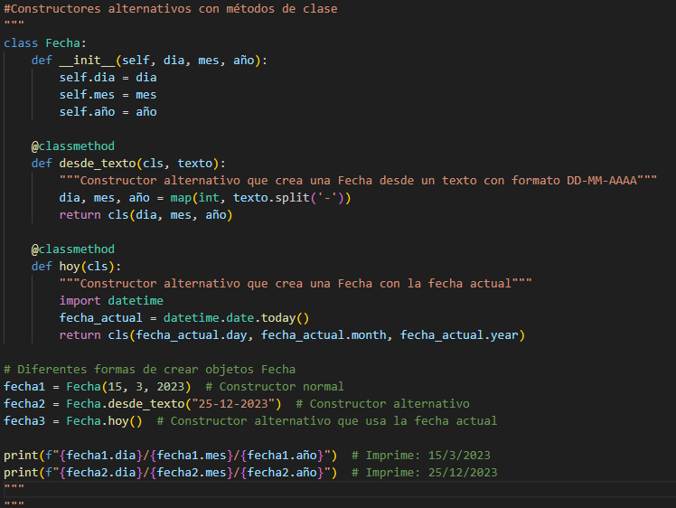
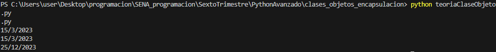
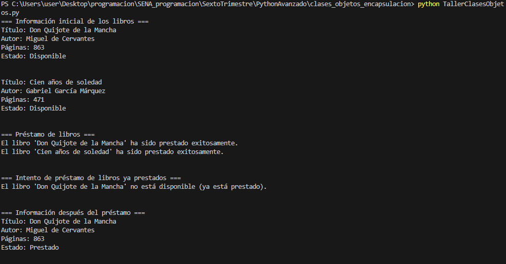

¿que es el diseño de clases?
El diseño de clases es como crear los "planos" de los objetos que vas a usar en tu programa. Es decidir:

¿Qué datos va a tener cada objeto (atributos)
¿Qué puede hacer cada objeto (métodos)
¿Cómo se relacionan entre sí las diferentes clases

¿que es la encapsulacion?
La encapsulación es como poner tus datos importantes en una "caja fuerte" y solo permitir el acceso de forma controlada. Es proteger la información interna de un objeto.

Para ejecutar el codigo en el caso de los laboratorios, las instrucciones son meter entre comillas triples y ejecutar usando el comando "python nombre del archivo.py"

En el caso de el proyecto integrador, o de los dos talleres, solo es usar el mismo comando si necesidad de usar comillas triples.

Como pequeña reflexion, el diseño de clases y la encapsulacion son conceptos importantes en el manejo de datos usando python, y tambien si es que se necesita trabajar con objetos, ya que funcionan para agrupar datos en una categoria en el cual la podriamos necesitar mas adelante.